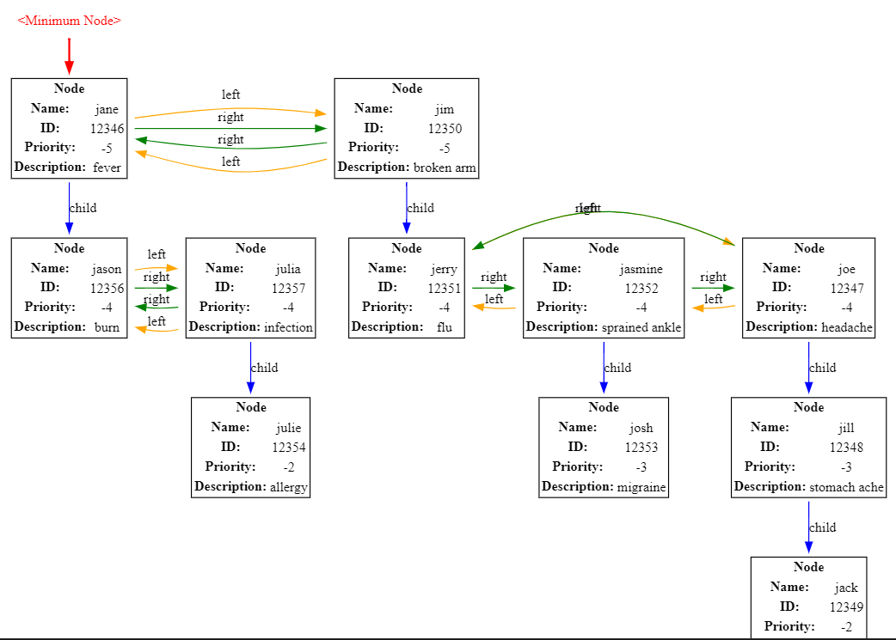

# **Emergency Hospital Patient Manager**  
Efficiently manage patient priorities in an emergency hospital using a custom implementation of a **Fibonacci Heap**. This system ensures optimal performance for critical operations like patient insertion, deletion, and retrieval.

---

## **Overview**  
This project implements a **Fibonacci Heap** from scratch and uses it as the backbone of a hospital patient manager. The heap allows:  
- **O(1)** insertion and deletion.  
- **O(log n)** retrieval of the highest-priority patient.  
By leveraging the Fibonacci Heap, this system is ideal for real-time emergency scenarios requiring rapid prioritization and task management.  

---

## **Features**  
- **Dynamic Patient Prioritization**:  
   Patients are assigned priorities based on urgency, age, and check-in time, recalculated dynamically.  

- **Core Operations**:  
   - Add patients with detailed information (e.g., name, ID, urgency score).  
   - View, retrieve, or process the highest-priority patient.  
   - Update urgency levels and re-prioritize.  
   - Delete patients from the queue.  

- **Custom Data Structures**:  
   Implements an advanced **Fibonacci Heap** for efficient task management.  

---

## **Key Files**  

| File                  | Description                                                                                 |
|-----------------------|---------------------------------------------------------------------------------------------|
| **`Fibonacci_Heap.h`** | Core implementation of the Fibonacci Heap, including operations like `insert`, `extractMin`, `merge`, and `decreaseKey`. |
| **`Patient.cpp`**      | Defines the `Patient` class, including attributes like `name`, `id`, `urgencyScore`, and dynamic priority calculations. |
| **`TaskManager.cpp`**  | Manages the overall patient queue using the Fibonacci Heap and supports core functionalities like adding, deleting, and processing patients. |

---

## **How It Works**  
1. **Patient Prioritization**:  
   The system calculates a patient’s priority dynamically based on:  
   - Urgency Score  
   - Age (higher weight for children and elderly)  
   - Check-in Time  

2. **Heap Operations**:  
   The Fibonacci Heap ensures efficient operations:  
   - **Insertion**: Adding new patients.  
   - **Deletion**: Removing patients.  
   - **Priority Updates**: Adjusting urgency dynamically.  

3. **System Layers**:  
   - **GUI**: Interface for interaction.  
   - **Entity Layer**: Encapsulates `Patient` details.  
   - **DAO Layer**: Handles data access and storage.  
   - **Service Layer**: Implements business logic, such as priority calculations.  
   - **Heap Layer**: Core operations of the Fibonacci Heap.

---

## **Visualization**  
  
*Dynamic patient queue visualized using Graphviz.*

---

## **Setup and Usage**  

### **Prerequisites**  
- C++ Compiler (e.g., GCC or Clang)  
- Graphviz (for heap visualization)

### **Steps**  
1. Clone the repository:  
   ```bash
   git clone https://github.com/yourusername/patient-manager.git
   cd patient-manager
   ```
2. Compile the project:  
   ```bash
   g++ -std=c++17 Patient.cpp TaskManager.cpp -o patient_manager
   ```
3. Run the program:  
   ```bash
   ./patient_manager
   ```

---

## **Acknowledgments**  
This project leverages advanced data structures to optimize patient management in emergency scenarios, demonstrating the power of algorithmic efficiency in real-world applications.  

--- 

Feel free to customize further, such as adding example outputs or instructions for specific features.
